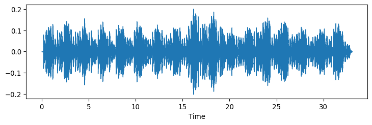

# Relative Mode

This package contains Python code for calculating _relative mode_ from an audio
signal. _Relative mode_ refers to the degree between how major or minor does
the segment of music sound at a given time. It is based on a classic
key-finding algorithm (Krumhansl-Schmuckler, 1990) and extracts the
pitch-class information using chromagrams. The relative mode is
calculated as the difference between the strongest major key and the
strongest minor key. Relative mode can vary from -1.0 (clearly in minor)
to + 1.0 (clearly in major) and gives a value between these extremes for the whole excerpt. Alternatively the algorithm can provide the output for each window of analysis (segments of 3 seconds as a default).

The algorithm and how it has been evaluated is documented in a
manuscript titled “Major-minorness in Tonal music – Evaluation of
Relative Mode Estimation using Expert Ratings and Audio-Based
Key-finding Principles” by Tuomas Eerola and Michael Schutz (in review).

### Libraries

``` python
import librosa.display
import matplotlib
import numpy as np
from matplotlib import pyplot as plt
import pandas as pd
```

### Load package using pip

``` python
pip install relative_mode
```

Make function calls explicit for the subsequent analyses.

``` python
from src.relative_mode import Tonal_Fragment
from src.relative_mode import relative_mode
from src.relative_mode import RME_across_time
```

### Load a music example

Recording of J.S. Bach’s *C Major Prelude* (WTC Book I) (an extract).

``` python
filename = 'data/Bach_1_Gould_0_Major_bachGould1971.wav'
y, sr = librosa.load(filename)
plt.figure(figsize=(9,2.5))
librosa.display.waveshow(y, sr = sr)
plt.show()
```



### Estimate relative mode

Here we don’t specify any parameters but just run `relative_mode`.

``` python
RM, RM_segments = relative_mode(y = y, sr = sr)
print(round(RM['tondeltamax'][0],3))
```

    0.258

The value of *0.258* could be called “moderately in major”. Value closer
to 0 would indicate no clear tendency for major or minor and any value
below -0.30 would suggest clearly in minor key.

This measure can be computed with a different options. You can alter key
profile (e.g. `krumhansl`, `albrecht` (default), `aarden`, or
`bellman`), similarity metrics (`pearson`, `cosine` (default), or
`euclidean`), chromatype from `CENS` to `CQT`. There are also some
alternative outputs of the measure.

``` python
RM2, RM2_segments = relative_mode(y = y, sr = sr, 
    profile = 'simple', 
    distance = 'pearson', 
    chromatype = 'CQT')
print(RM2)
```

       tonmaxmaj  tonmaxmin  tondeltamax  tondeltamaxMd  tondeltamaxSi
    0   0.688322   0.640134     0.144563       0.176965            3.0

### Estimate relative mode across the excerpt

``` python
fig, RM3 = RME_across_time(filename = filename, 
    winlen = 3, hoplen = 3, cropfirst = 0, croplast = 0, 
    chromatype = 'CENS', 
    profile = 'albrecht',
    distance = 'cosine',
    plot = True)
fig
plt.show()
```


